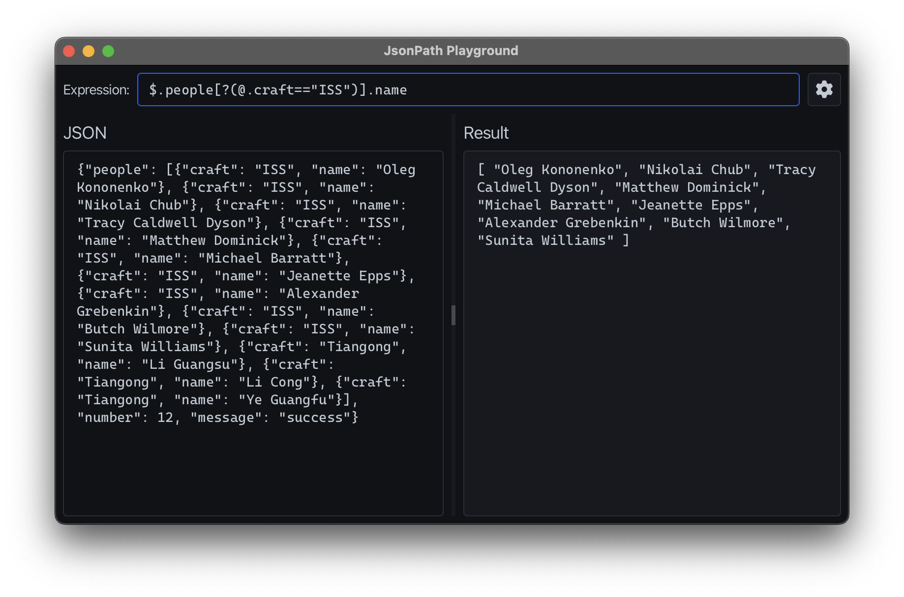

# JsonPath Playground

An offline, JsonPath playground written with JavaFX and jayway.



## Running
To run the pre-built binaries, uncompress the file for your platform and run 
the launcher script located at `./bin/playground` (MacOS and Linux) or 
`.\bin\playground.bat` (Windows) 

## Building
To build the project and create binaries, run:
```shell
mvn clean package -DskipCompress
```

If you want to create `zip` and `tar.gz` archives, remove the `-DskipCompress`
option. Archives will be placed in the `target/packaged/` directory.
```shell
mvn clean package
```

To run the application, execute the launcher script:

MacOS and Linux:
```shell
./target/jlink-image/bin/playground
```
Windows:
```shell
.\target\jlink-image\bin\playground.bat
```

## License
This project is licensed under the MIT license.
See the LICENSE file for more information.